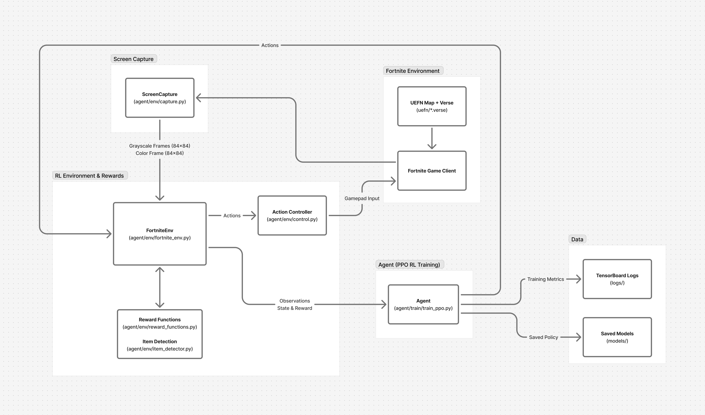

# BuildBot: Fortnite Reinforcement Learning Agent

BuildBot is a group project for CAP4621: Artificial Intelligence that trains an AI to play Fortnite using reinforcement learning, computer vision, and behavior cloning.

The system captures the game screen in real time, sends actions to the player character, and learns from reward signals extracted from gameplay.

## Setup

Before starting:

- Install **[Miniconda](https://docs.conda.io/en/latest/miniconda.html)**

Clone the repository
```bash
git clone https://github.com/johanfortus/BuildBot
cd BuildBot
```

Create the conda environment
```bash
conda create -n buildbot python=3.11
conda activate buildbot
```

Install dependencies
```bash
pip install -r requirements.txt
```

To use the RL agent within our provided environments, follow the environment setup instructions here:

➡️ **[uefn/README.md](uefn/README.md)**  

## Training

### PPO (Proximal Policy Optimization)

Train the agent using PPO reinforcement learning:

```bash
python -m agent.train.train_ppo
```

The training will:
- Run for 1,000,000 timesteps by default
- Save the model to `models/buildbot_ppo` on completion or interruption (Ctrl+C)
- Log training metrics to `./logs` for TensorBoard visualization

To view training progress with TensorBoard:
```bash
tensorboard --logdir ./logs
```

### Behavior Cloning

*Currently in development.*

**Training Tips:**
- Press `CTRL + C` during training to safely stop and save the current model
- Models are automatically saved to the `models/` directory

## System Architecture

The BuildBot system is composed of four core subsystems:

1. **Screen Capture** - Reads gameplay frames for observations and reward signals
2. **RL Environment & Rewards** - Converts frames into state, computes rewards, and manages episode logic
3. **Agent** - Learns a policy using Stable-Baselines3
4. **Fortnite Environment** - An environment built in Unreal Engine for Fortnite (UEFN), using Verse scripts to trigger HUD flashes that the agent detects as reward signals.

Below is the full end-to-end workflow describing how observations, actions, and rewards move through the system:



## Analysis

### Plot training rewards

You can plot episode rewards (and run duration) from TensorBoard logs with:

**Latest run across all logs:**
```bash
python -m analysis.plot_rewards
```
 
**Specific run:**
```bash
python -m analysis.plot_rewards RUN_NAME
```

Replace `RUN_NAME` with your run directory name, e.g.:
```bash
python -m analysis.plot_rewards PPO_16
```

## Fortnite Settings

To ensure consistent computer-vision detection and reward tracking,
Fortnite must run using the following graphics settings:

**Resolution:** 1920 x 1080  
**Rendering Mode:** DirectX12  
**Brightness:** 100%  
**User Interface Contrast:** 1x  
**Color Blind Mode:** Off  
**Color Blind Strength:** 5  
**Anti-Aliasing & Super Resolution:** NVIDIA DLSS  
**Global Illumination:** Ambient Occlusion  
**Reflections:** Screen Space  
**Shadows:** High  
**View Distance:** Epic  
**Textures:** High  
**Effects:** High  
**Post Processing:** Medium  
**HUD Scale:** 100%  

If your Fortnite colors differ or detection seems off,
you can tune HSV thresholds using the tools inside:

➡️ **[vision/README.md](vision/README.md)**  