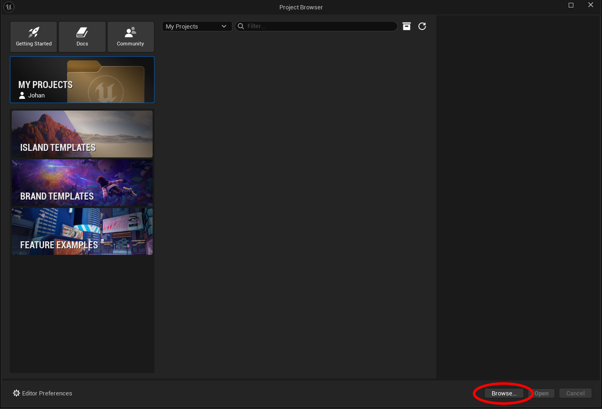
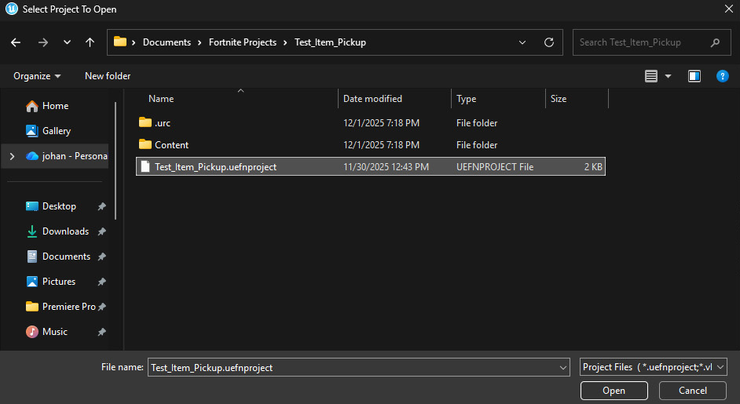
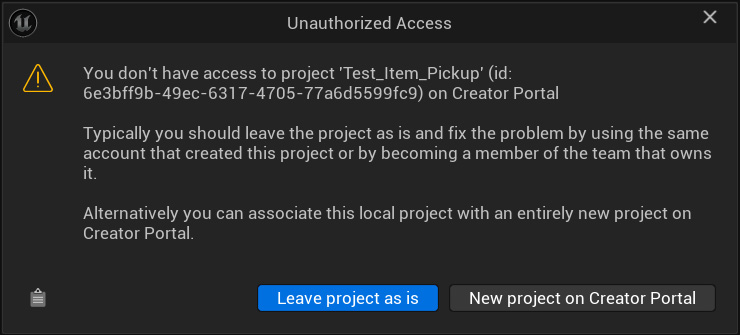

# UEFN Environment Setup

This guide explains how to set up the Fortnite island and UEFN environment required for the BuildBot reinforcement-learning agent.  
The Python agent relies on a controlled and reproducible island configuration, including item spawners, Verse devices, and consistent lighting.

---

## 1. Prerequisites

### Required Software
- **Fortnite (PC)**  
  Install via the Epic Games Launcher.

- **Unreal Editor for Fortnite (UEFN)**  
  Also available through the Epic Games Launcher.

### Required Project Files
Download our UEFN project files from Google Drive:

📁 **Google Drive Folder:**  
> https://drive.google.com/drive/folders/1s85hk-OjtU2t_vsb0urC5sK6eKcm2kN3?usp=sharing

The folder includes:

- `Test_Item_Pickup.zip` — Item pickup training environment
- `Test_Shoot_Enemy.zip` — Enemy shooting training environment

---

## 2. Installing the Island Files

1. Open UEFN.
2. In the Project Browser, click **Browse**. This opens your Fortnite Projects folder.

    

3. Download `Test_Item_Pickup.zip` from the Google Drive folder.
4. Open a second file explorer window and extract the ZIP.
5. Move the extracted folder:

    `Test_Item_Pickup/`

    into your Fortnite Projects folder.

6. Back in the Fortnite Projects folder opened through UEFN, navigate into `/Test_Item_Pickup/`, select `Test_Item_Pickup.uefnproject` and click **Open**.

    

7. When prompted with the Unauthorized Access window, click **New project on Creator Portal**.

    

> To install the enemy shooting environment (`Test_Shoot_Enemy.zip`), repeat the same steps using that folder.

---

## 3. Setup

1. Click **Launch Session** in UEFN.
2. Ensure your Fortnite graphics settings match the ones listed in the main BuildBot README:  
   ➡️ https://github.com/johanfortus/BuildBot/tree/main#fortnite-settings
3. Verify that the Verse device using `spawn_random_item_spawner` is functioning.  
   If it is not already present, add it using the provided Verse script:  
   ➡️ [`spawn_random_item_spawner.verse`](./spawn_random_item_spawner.verse)  
   Then assign all required `@editable` references:

   - `ItemSpawnersArray` — add **all** item spawner devices in your island  
   - `CurrentItemSpawner` — assign it to the **first** item spawner in the array  
   - `HUD` — assign your HUD message device  
   - `ItemRemover` — assign your item remover device

---

Once your session launches successfully and the island behaves as expected, your UEFN environment is fully configured.

You can now return to the main project and begin training the agent:

➡️ **Start Training**  
https://github.com/johanfortus/BuildBot/tree/main#training