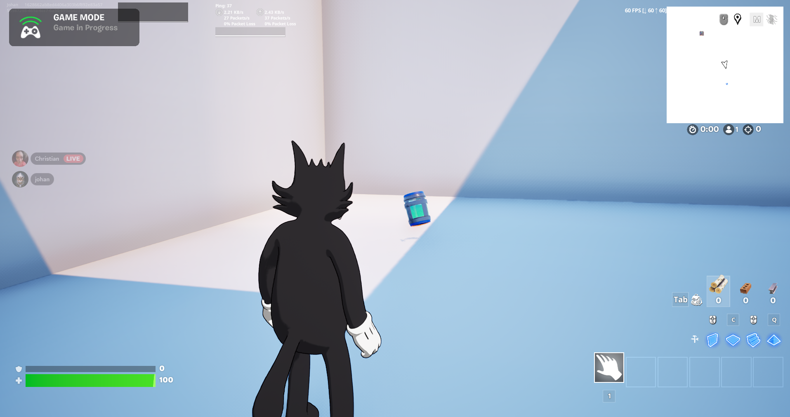
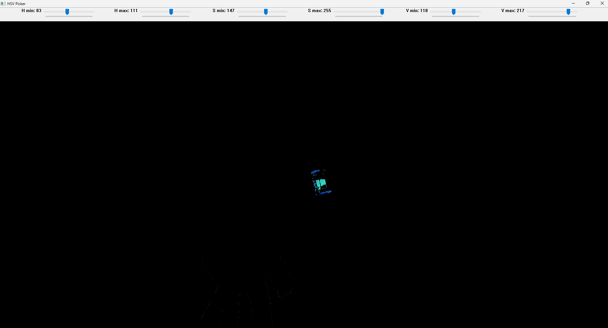
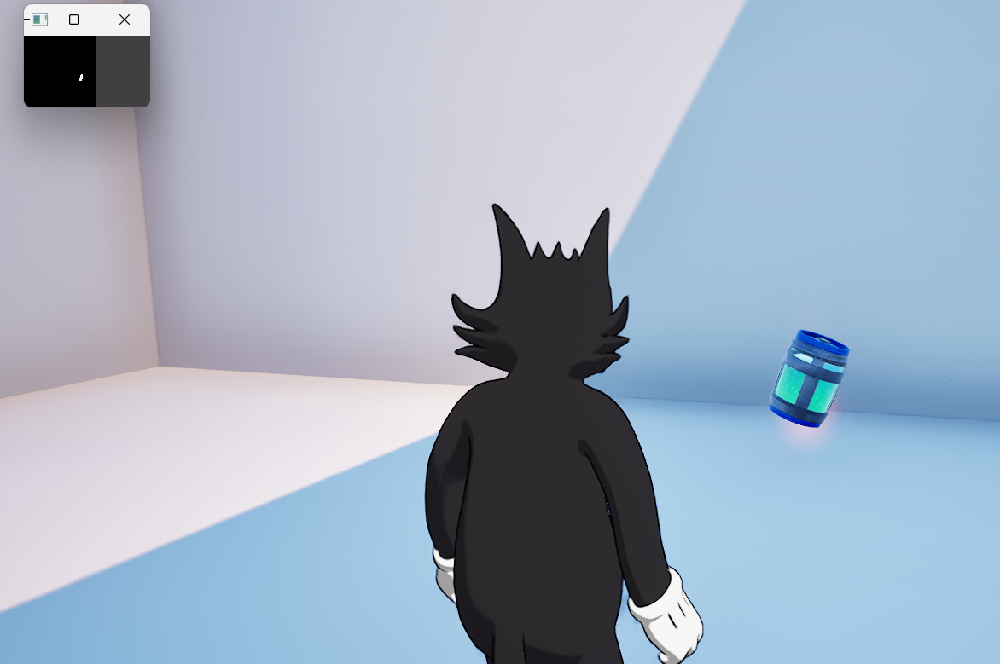

# Vision Tools

This directory contains HSV color calibration and mask visualization tools for detecting items in the game environment.

## Tools

- **`pick_hsv.py`** - HSV color range picker for calibrating item detection
- **`mask_viewer.py`** - Real-time mask viewer to test HSV calibration values

## Calibration Workflow

### Step 1: Capture Reference Image

Start by taking a screenshot of the player standing in front of the object you want the agent to detect. The image should clearly show the target object.



### Step 2: Calibrate HSV Values

Navigate into the vision folder and run the HSV picker tool:

```bash
cd vision
python pick_hsv.py
```

Adjust the trackbars (H min/max, S min/max, V min/max) until only the target item remains visible:



When you're satisfied with the calibration, press **ESC** to exit. The tool will print the `LOWER` and `UPPER` HSV values to the console.

### Step 3: Update Item Detector

Copy the printed HSV values and update them in `agent/env/item_detector.py`:

```python
LOWER_COLOR = np.array([h_min, s_min, v_min])  # Your calibrated values
UPPER_COLOR = np.array([h_max, s_max, v_max])  # Your calibrated values
```

### Step 4: Test the Calibration

Navigate back to the root directory and run the mask viewer to test your HSV values in real-time:

```bash
cd ..
python mask_viewer.py
```

